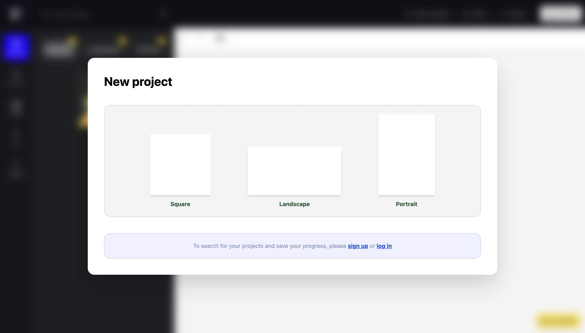

<!--
*** Thanks for checking out the Best-README-Template. If you have a suggestion
*** that would make this better, please fork the repo and create a pull request
*** or simply open an issue with the tag "enhancement".
*** Don't forget to give the project a star!
*** Thanks again! Now go create something AMAZING! :D
-->

<!-- PROJECT SHIELDS -->
<!--
*** I'm using markdown "reference style" links for readability.
*** Reference links are enclosed in brackets [ ] instead of parentheses ( ).
*** See the bottom of this document for the declaration of the reference variables
*** for contributors-url, forks-url, etc. This is an optional, concise syntax you may use.
*** https://www.markdownguide.org/basic-syntax/#reference-style-links
<!-- PROJECT LOGO -->
 

  

<h3 align="center">PICO Editor</h3>

  

     
    <a href="https://github.com/NaimCode/DiplomaHub-DApp"><strong>Explore the docs »</strong></a>
     
     
    <a href="https://github.com/NaimCode/DiplomaHub-DApp">View Demo</a>
    ·
    <a href="https://github.com/NaimCode/DiplomaHub-DApp/issues">Report Bug</a>
    ·
    <a href="https://github.com/NaimCode/DiplomaHub-DApp/issues">Request Feature</a>
  

<!-- TABLE OF CONTENTS -->

<!-- ABOUT THE PROJECT -->
## About The Project

               New project

               Unsplash integreted

              Explore more elements to use
 

(<a href="#top">back to top</a>)

### Built With

* [React.js](https://reactjs.org/)
* [Vite3](https://vitejs.dev/)
* [Typescript](https://www.typescriptlang.org/)
* [Firebase](https://firebase.google.com/)
* [Geist-UI](https://geist-ui.dev/en-us)
* [TailwindCSS](https://tailwindcss.com/)

(<a href="#top">back to top</a>)

<!-- CONTRIBUTING -->
## Contributing

Contributions are what make the open source community such an amazing place to learn, inspire, and create. Any contributions you make are **greatly appreciated**.

If you have a suggestion that would make this better, please fork the repo and create a pull request. You can also simply open an issue with the tag "enhancement".
Don't forget to give the project a star! Thanks again!

1. Fork the Project
2. Create your Feature Branch (`git checkout -b feature/AmazingFeature`)
3. Commit your Changes (`git commit -m 'Add some AmazingFeature'`)
4. Push to the Branch (`git push origin feature/AmazingFeature`)
5. Open a Pull Request

(<a href="#top">back to top</a>)

<!-- LICENSE -->
## License

Distributed under the MIT License. 

(<a href="#top">back to top</a>)

<!-- MARKDOWN LINKS & IMAGES -->
<!-- https://www.markdownguide.org/basic-syntax/#reference-style-links -->